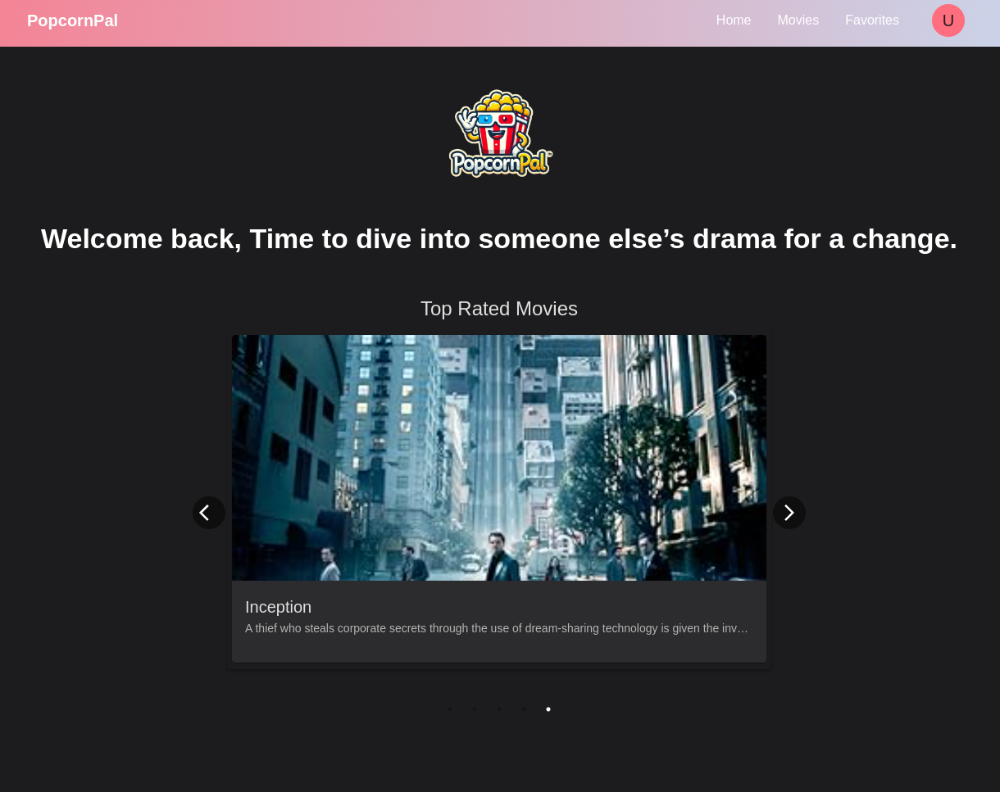

<!-- PROJECT LOGO -->

  

 

<h3 align="center"> PopcornPal </h3>

  

    Movie Discovery App | Full-stack | Responsive
     
     
    <a href="https://popcornpal-webapp-7gwl.vercel.app/">View Demo</a>
    ·
    <a href="https://github.com/shpokas-io/popcornpal-webapp/issues">Report Bug</a>
    ·
    <a href="https://github.com/shpokas-io/popcornpal-webapp/issues">Request Feature</a>
  

<!-- TABLE OF CONTENTS -->

  
Table of Contents

  <ol>
    <li>
      <a href="#about-the-project">About The Project</a>
      <ul>
        <li><a href="#built-with">Built With</a></li>
      </ul>
    </li>
    <li>
      <a href="#installation">Installation</a>
    </li>
    </li>
    <li><a href="#contact">Contact</a></li>
    <!-- <li>
      <a href="#left-to-do">Left To Do</a>
    </li> -->
    <li>
      <a href="#future-development">Future development</a>
    </li>
  </ol>

<!-- ABOUT THE PROJECT -->

## About The Project

This project is my take on the test task for ["Ababa.tech"](https://ababa.tech/apie-mus/karjera/testine-uzduotis/).
Given the focus on speed, my goal was to build a fully functional application from Monday to Friday,  prioritizing clean code and packing in as many features as possible within that timeframe.
To test website use Email: testuser@example.com , Password: testpassword

- Search & Browse: Discover movies with search and filter options.
- Favorites List: Save movies you love to your favorites.
- Pagination: Easily browse through a large movie collection.
- Responsive: Optimized for both desktop and mobile use.

 

(<a href="#readme-top">back to top</a>)

### Built With

##### Back end

- ![NestJS][NestJS]
- ![Node.js][Node.js]
- ![TypeScript][TypeScript]
- ![Supabase][Supabase]
- ![JWT][JWT]

##### Front end

- ![React][React]
- ![TypeScript][TypeScript]
- ![Redux][Redux]
- ![MaterialUI][MaterialUI]
- ![Vite][Vite]
- ![NPM][NPM]

(<a href="#readme-top">back to top</a>)

### Installation

#### Frontend setup

1. Clone the frontend repository: 
   `git clone https://github.com/shpokas-io/popcornpal-webapp.git`
2. Navigate to the frontend directory: 
   `cd popcornpal-frontend`
3. Install dependencies: 
   `npm install`
4. Create a .env file in the frontend directory:

- VITE_API_URL=http://localhost:3000

5. Run the frontend development server: 
   `npm run dev` 
   The frontend will run on http://localhost:5173 by default.

6. Or simply use my live [link](https://popcornpal-webapp-7gwl.vercel.app/)

### Future development

#### Known bugs

- Favorite Page: When a movie is removed from favorites, the "Add to Favorite"  button briefly appears before the item is fully removed from the list.
- Search Functionality: The search results only display movies from the currently selected page,  making it difficult to find items on other pages unless you return to the first page.

#### Future improvements

- Enhanced Loading Speed: Work on optimizing load times to improve user experience,  as the current page load may feel slow.
- Implement Caching: Introduce caching mechanisms to reduce redundant data fetching  and speed up content delivery across pages.

## Contact

Skirmantas Spakovskis - [@LinkedIn](https://www.linkedin.com/in/skirmantasspakovskis/) - skirm.spak@gmail.com

(<a href="#readme-top">back to top</a>)

<!-- MARKDOWN LINKS & IMAGES -->
<!-- https://www.markdownguide.org/basic-syntax/#reference-style-links. -->

[NPM]: https://img.shields.io/badge/NPM-%23000000.svg?style=for-the-badge&logo=npm&logoColor=white
[Webpack]: https://img.shields.io/badge/webpack-%238DD6F9.svg?style=for-the-badge&logo=webpack&logoColor=black
[Vite]: https://img.shields.io/badge/Vite-B73BFE?style=for-the-badge&logo=vite&logoColor=FFD62E
[JavaScript]: https://img.shields.io/badge/javascript-%23323330.svg?style=for-the-badge&logo=javascript&logoColor=%23F7DF1E
[React]: https://img.shields.io/badge/React-%2361DAFB.svg?style=for-the-badge&logo=react&logoColor=white
[HTML5]: https://img.shields.io/badge/html5-%23E34F26.svg?style=for-the-badge&logo=html5&logoColor=white
[CSS3]: https://img.shields.io/badge/css3-%231572B6.svg?style=for-the-badge&logo=css3&logoColor=white
[Parcel]: https://img.shields.io/badge/Parcel-%23B93C00.svg?style=for-the-badge&logo=parcel&logoColor=white
[SCSS]: https://img.shields.io/badge/SCSS-%23CC6699.svg?style=for-the-badge&logo=sass&logoColor=white
[Webpack]: https://img.shields.io/badge/Webpack-8DD6F9?style=for-the-badge&logo=webpack&logoColor=white
[ASP.NET Core]: https://img.shields.io/badge/ASP.NET%20Core-%230078D7.svg?style=for-the-badge&logo=aspnetcore&logoColor=white
[Tailwind CSS]: https://img.shields.io/badge/Tailwind%20CSS-%2338B2AC.svg?style=for-the-badge&logo=tailwindcss&logoColor=white
[Entity Framework Core]: https://img.shields.io/badge/Entity%20Framework%20Core-%23094E9C.svg?style=for-the-badge&logo=dotnet&logoColor=white
[NestJS]: https://img.shields.io/badge/NestJS-E0234E.svg?style=for-the-badge&logo=nestjs&logoColor=white
[Redux]: https://img.shields.io/badge/Redux-764ABC.svg?style=for-the-badge&logo=redux&logoColor=white
[MaterialUI]: https://img.shields.io/badge/Material%20UI-0081CB.svg?style=for-the-badge&logo=mui&logoColor=white
[TypeScript]: https://img.shields.io/badge/TypeScript-3178C6.svg?style=for-the-badge&logo=typescript&logoColor=white
[Supabase]: https://img.shields.io/badge/Supabase-3ECF8E.svg?style=for-the-badge&logo=supabase&logoColor=white
[Node.js]: https://img.shields.io/badge/Node.js-339933.svg?style=for-the-badge&logo=nodedotjs&logoColor=white
[JWT]: https://img.shields.io/badge/JWT-000000.svg?style=for-the-badge&logo=jsonwebtokens&logoColor=white
[product-screenshot]: public/images/prev.png
